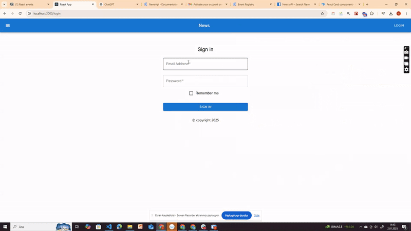

# NewsApp Using Redux Toolkit

## Description

This project demonstrates the usage of **Redux Toolkit** for state management by building a **News Application** that fetches data from **NewsAPI**. The application includes a **Login system** and leverages **React Router** for navigation.

---

## Problem Statement

Your company needs a demo project to showcase how **Redux Toolkit** can be effectively used to manage state in a React application.

### The project contains:

- **Login Page**:
  - The user can enter their credentials.
  - Upon successful login, the user is redirected to the main page.

- **News Dashboard Page**:
  - The latest news articles are fetched and displayed from **NewsAPI**.
  - Users can view headlines and article summaries.
  - State is managed effectively using **Redux Toolkit**.

---

## Highlights

This project showcases the following **Redux Toolkit** concepts:

- **Slices**
- **Async Thunks**
- **Store Configuration**
- **Connecting Components with Redux**
- **Handling API Calls and Managing State**

---

## Expected Outcome

The project includes two main features:

### 1. Login

A simple login page where the user can:

- Enter their credentials (username and password).
- Be redirected to the main dashboard upon successful login.

**Example UI**:

- Input fields for **Username** and **Password**.
- Button: **Login**.

---

### 2. News Dashboard

A dynamic dashboard where the user can:

- View a list of the latest news articles fetched from **NewsAPI**.
- See headlines, summaries, and links to full articles.

**Example UI**:

- A list of articles with the following structure:
  - **Headline (Title)**
  - **Description**
  - **Read More** (link to the full article).

---

## Objective

The objective is to showcase the usage of:

- **Redux Toolkit** for state management.
- **React Router** for navigation in a React application.

This is achieved by building:

1. A **Login System** with authentication logic.
2. A **News Dashboard** that displays data fetched from an external API.

---

## Project Snapshot

(Snapshot or UI demo screenshots can be added here.)

## Live Demo

[Live NewsApp Project](https://hellenkuttery.github.io/redux-toolkit-project/)

---

## Notes

- The **Login** and **News Dashboard** components are located under the `src/components` directory.
- Redux Toolkit-related files, such as slices and store, are located under the `src/redux` directory.
- News data is fetched from **NewsAPI** using **async thunks** in **Redux Toolkit**.
- **React Router** is used to handle navigation between the login page and the news dashboard.

